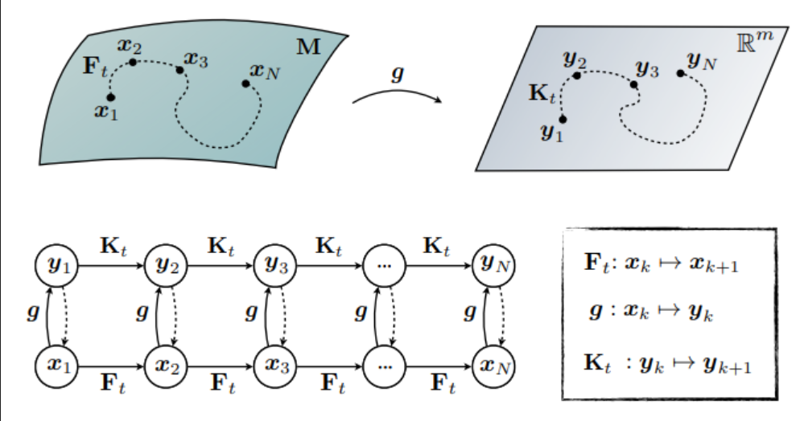
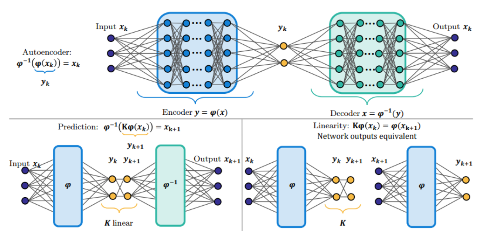

# Koopman Operators
Many real-world systems are nonlinear (e.g. fluids, robots, biology), and there are many goals associated with analyzing dynamical systems:
1. Long-term future state prediction
2. Control through feedback
3. Interpretability of a system's behavior

Modern systems have 2 main challenges: (1) Nonlinearity—well-developed tools for linear dynamic analysis can't be used. (2) Unknown dynamics—the lack of governing equations for realistic systems means all models are merely approximations. Koopman operators promise to take nonlinear dynamics and move them to a space where linear techniques can be used. Why linear? Closed solutions that are easy to work with.

Let's say a discrete-time dynamical system has the form $x_{k+1} = f(x_k)$. Now suppose the system is linear, so that $x_{k+1} = A x_k$, where $A \in \mathbb{R}^{n \times n}$.  The dynamics are characterized by the eigenvalues and eigenvectors of $A$, given by the spectral decomposition $A T = T \Lambda$, where $\Lambda$ is a diagonal matrix with eigenvalues $\lambda_j$ and $T$ is a matrix whose columns are the linearly independent eigenvectors. Then the dynamics solution is
$$
x_k = A^{k-k_0} x_{k_0} = T \Lambda^{k-k_0} T^{-1} x_{k_0}.
$$
The matrix $T^{-1}$ defines a transformation $z_k = T^{-1} x_k$ into eigenvector coordinates where the dynamics become decoupled and each coordinate $z_j$ only depends on itself: $z_{k+1} = \Lambda z_k$, or equivalently $z_{j,k+1} = \lambda_j z_{j,k}$.  This simplicity merits the use of linear discrete-time dynamics.

## Section 1: Koopman Operator Theory
The Koopman operator advances not the state, but the measurement functions of the state with the flow of the dynamics. Let's say we have an observable $g: M \rightarrow \mathbb{R}$ which are elements of an infinite-dimensional Hilbert space. The Koopman operator $\mathcal{K}_t$ is an infinite-dimensional linear operator that acts on $g$ as $\mathcal{K}_t g = g \circ F_t$, where $\circ$ is the composition operator. For a discrete system with timestep $\Delta t$ we get:
$$\mathcal{K}_{\Delta t}g(x_k) = g(F_{\Delta t}(x_k)) = g(x_{k+1})$$
So the Koopman operator defines a system that advances the observation of state $g_k$ to the next time step. This operator is also linear, which is inherited from the linearity of the addition operation in function spaces.  

Although linear, working in infinite dimensions is difficult. Instead of capturing the evolution of all measurement functions, applied Koopman analysis aims to use key measurement functions that evolve linearly with dynamics. One example of a "key measurement function" are eigenfunctions, so we can replace $g$ with an eigenfunction $\phi(x)$, and we get:
$$\mathcal{K}_{\Delta t}\phi(x_k) = \phi(x_{k+1}) = \lambda \phi(x)$$
A cheeky example here is when $\lambda=1$ we know that the measurement corresponding to that eigenfunction is conserved over dynamics. 

One eigenfunction is usually not enough to describe a system, so we often take multiple measurements of a system and arrange the observables into a vector $${g}({x})
= \begin{bmatrix}
g_1({x}) \\
g_2({x}) \\
\vdots \\
g_p({x})
\end{bmatrix}
= \sum_{j=1}^{\infty} \phi_j({x})\, {v}_j$$
where $v_j$ is the j-th Koopman mode associated with $\phi_j$. The mode is a fixed vector pattern telling you how $\phi_j$ appears in each channel $g_i$. Given the decomposition of $g$ earlier, we can represent the dynamics as follows:
$$
g(x_k) = \mathcal{K}^k_{\Delta t} g(x_0) = \mathcal{K}^k_{\Delta t}\sum_{j=1}^{\infty} \phi_j({x_0}) {v}_j = \sum_{j=1}^{\infty} \lambda_j^k \phi_j({x_0}) {v}_j
$$
and the sequence of triples $\{(\lambda_j, \phi_j, v_j)]\}_{j=0}^\infty$ are known as the Koopman mode decomposition which will be connected to the dynamic mode decomposition. The payoff here is that time-dependence is just based on $\lambda_j^k$ and everything nonlinear gets lifted into coordinates $\phi_j(x_0)$.

## Section 2: Dynamic Mode Decomposition
As mentioned earlier, Koopman dynamics can only be applied in a finite-dimensional way. Invariant subspaces provide the bridge between Koopman theory and practical algorithms. A subspace $\mathcal{V}$ of observables is Koopman-invariant if $f \in \mathcal{V} \implies \mathcal{K}f \in \mathcal{V}$. If we choose a finite set of observables $[\phi_1 \dots \phi_p]$, whose span is approximately invariant, then Koopman acts like a matrix on the lifted coordinates $z=\phi(x)$: $\phi(F(x)) = A \phi(x)$ and becomes easy to use. Dynamic Mode Decomposition (DMD) is an algorithm to find these observables. 

DMD was initially developed as a way to identify spatio-temporal coherent structures from high-dimensional data. This is able to approximate the Koopman operator restricted to the set of direct measurements of a state in a high-dimensional system. First collect measurements $\{(x(t_k), x(t'_k))\}_{k=1}^m$ where $t'_k = t_k + \Delta t$. These snapshots are arranged into two data matrices $X, X'$: 
$$
\begin{aligned}
X &=
\begin{bmatrix}
\; \big| & \big| &        & \big| \\
x(t_1)   & x(t_2) & \cdots & x(t_m) \\
\; \big| & \big| &        & \big|
\end{bmatrix}
\\[1ex]
X' &=
\begin{bmatrix}
\; \big| & \big| &        & \big| \\
x(t'_1)  & x(t'_2) & \cdots & x(t'_m) \\
\; \big| & \big| &        & \big|
\end{bmatrix}
\end{aligned}
$$
The goal is to find a best-fit linear operator that relates $X' \approx A X$ and the best fit operator is defined by $A= \operatorname*{argmin}_{A} ||X'-AX||_F = X'X^\dagger$ where $||\cdot||_F$ is the Frobenius-norm and $^\dagger$ is pseudoinverse. Here $A$ resembles the Koopman operator. In words, we want to minimize the difference between the next measurements and the koopman operator applied to the current measurements.

$A$ would be nice to have, but is intractable to represent (or compute its spectral decomposition) due to the $n^2$ possible elements. Instead, we can compute the SVD of $X$ to get $X^\dagger$ since it will likely be of at most rank $m$ (thus $A$ is also rank $m$). We compute the projection of $A$ onto the leading singular vectors, resulting in a smaller $m \times m$ matrix $\tilde{A}$. 

From this we can approximate the eigenvectors of $A$ without ever resorting to computations on the full matrix. The DMD algorithm is given below:
1. Compute the singular value decomposition of $X \approx \tilde{U}\tilde{\Sigma}\tilde{V}^*$. Here choosing the rank $r$ of the data matrix $X$ is a subjective step based on the necessary dimensionality reduction. The columns of $\tilde{U}$ are known as POD modes and satisfy $\tilde{U}^* \tilde{U} = I$
2. The full matrix $A=X'\tilde{V}\tilde{\Sigma}^{-1}\tilde{U}^*$ , but we're only interested in the leading $r$ eigenvalues/vectors so we can project $A$ onto the POD modes of $U$: $\tilde{A} = \tilde{U}^*X'\tilde{V}\tilde{\Sigma}^{-1}$. 
3. The spectral decomposition of $\tilde{A}$ is $\tilde{A}W = W\Lambda$ where the diagonal matrix $\Lambda$ are DMD eigenvalues (also eigenvalues of $A$) and the columns of $W$ are eigenvectors of $\tilde{A}$. 
4. The DMD modes $\Phi$ are reconstructed as: $\Phi = X'\tilde{V}\tilde{\Sigma}^{-1}W$ 
The DMD modes are eigenvectors of $A$ corresponding to the eigenvalues in $\Lambda$. 
$$\begin{aligned}
A\Phi
&=
\left(
X^{\prime}\,\tilde{V}\,\tilde{\Sigma}^{-1}\,
\underbrace{\tilde{U}^{*} X^{\prime}\,\tilde{V}\,\tilde{\Sigma}^{-1}}_{\tilde{A}}
\,W
\right)
\\
&=
X^{\prime}\,\tilde{V}\,\tilde{\Sigma}^{-1}\,\tilde{A}\,W
\\
&=
X^{\prime}\,\tilde{V}\,\tilde{\Sigma}^{-1} W \Lambda
\\
&=
\Phi \Lambda .
\end{aligned}$$

Another method, Extended DMD (eDMD) uses a similar approach but constructs $y = \Theta^T(x)$ where $\Theta$ may contain the original state as well as nonlinear measurements. Because $y$ may be significantly larger than $x$, kernel methods are often used in the algorithm. This approach works better in principle, as it provides a larger, richer basis to approximate the Koopman operator. 

## Section 3: Deep Learning
Deep learning has also emerged as a well-suited method for discovering and representing the arbitrarily complex eigenfunctions associated with a Koopman operator. The goal is to learn a few key latent variables $y=\phi(x)$ to parameterize the dynamics. The models are also often trained with a loss constraining them to have linear dynamics $||\phi(x_{k+1}) - K\phi(x_k)||$ where K is a matrix. Sometimes VAEs are also used for stochastic dynamical systems, like molecular dynamics, where the mapping back from the latent to a physical space is probabilistic. For many systems a few latent variables may be good enough, but there exist cases where systems will defy low-dimensional Koopman representations (such as a classical pendulum,  as it has a continuous eigenvalue spectra).

[This paper](https://www.arxiv.org/abs/2505.13358) is a neat example of using Koopman operators as a one-step offline distillation method for diffusion models. Given some noisy and clean data $(x_T, x_0)$, there exists a transformation $x_0 = \phi_T^{-1}(x_T)$ where $\phi_T^{-1}$ is an unknown nonlinear map. The goal is to model this transformation using a finite-dimensional linear operator in the latent space. This is the exact setup Koopman operators are good at.

To achieve this, the paper introduces observable functions ${g_1, g_2, \dots, g_d}$ parameterized as encoder networks $E_\phi, E_\varphi$ for $x_0, x_T$ that map states into the latent space. The dynamics in the latent space are assumed linear via a Koopman operator linear layer $C_\eta$. A decoder network $D_\psi$ maps the evolved observables back into the data space. So the final objective is:
$$x_0 \approx D_\psi(C_\eta E_\varphi(x_T))$$Their results on higher-dimensional datasets like FFHQ and AFHQv2 are 2-3x higher FID compared to EDM but also 1 NFE step instead of 79. We see that their FID scores do quite well for offline-distillation methods, but not so much compared to other flow-based or diffusion distillation-based methods. One thing to note is that Koopman operators may not be useful in online-settings due to encountering OOD data which would break the existing learned "observables."

## Section 4: Conclusion
In conclusion, the overall idea of Koopman operators is that finding linear structure in nonlinear systems is valuable: you get the prediction and control tools of linear systems not available in nonlinear systems. Koopman theory doesn't linearize the state, but rather finds coordinates (oftentimes eigenfunctions) where the evolution is linear.  However, Koopman operators don't give you the right coordinates for free. DMD works when the measurement space is enough to understand the relevant eigenfunction content and eDMD works by enriching the dictionary. Deep learning allows learning observables directly, but inherits the usual neural network issues: stability, extrapolation, and whether the learned latent variables correspond to anything meaningful.

However, Koopman operators aren't free lunch. Systems sometimes don't admit a low-dimensional Koopman representation (for example continuous spectra, insufficient observables, etc.), so Koopman operators would not be the right choice to model them. Koopman operators are also brittle to out-of-distribution data, so using them in an online setting may be tricky.