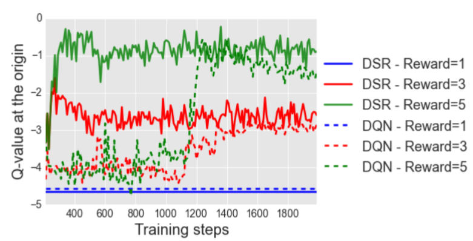
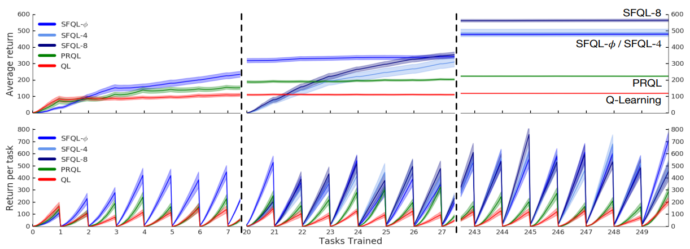
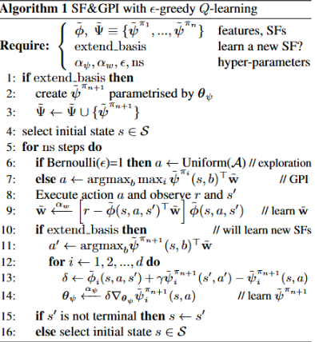
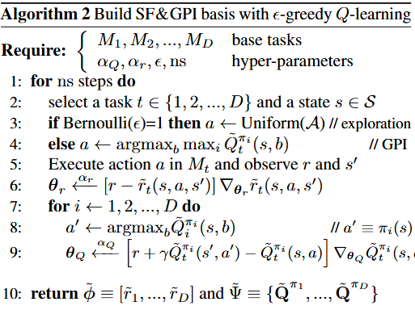
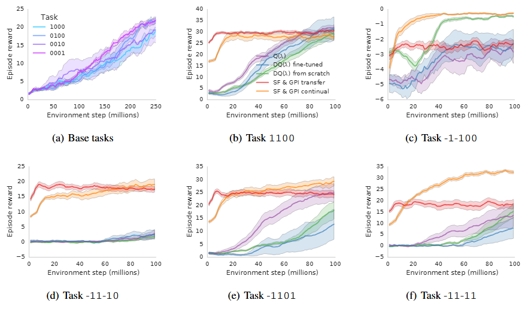

# Successor Features
Imagine a small mobile robot assistant in a kitchen. It moves in a simple grid Fridge → Counter → Sink. At first, the robot's only goal is to reach the sink, which is when it gets a reward.

But halfway through training, a chef decides that the robot's job is now to just transport ingredients to the counter. A policy trained via Q-learning has a problem: it has confounded the transitions (Fridge → Prep → Sink) and the old reward. To adapt to it's new goal it needs to relearn values from scratch. This is slow and unstable, especially in larger, more complex scenarios.

## Section 1: Successor Representations
We need a representation that separates dynamics from rewards, which is why we'll build up intuition for a "Successor Representation (SR)." These methods sit between model-free and model-based RL.
- Standard Q-learning is model-free: it doesn't learn how the world works, just how good actions are. This is good for when rewards don't change, but terrible when they do
- Model-based RL learns the full transition dynamics and can instantly recompute values for new rewards, but at the very expensive cost of modelling the world and planning inside it.
SRs don't predict rewards, they only predict where you're going to be, which makes them in sorts a "world model" that's tailored for transfer.

---
Suppose we have a standard MDP $(S, A, P, R, \gamma)$ 
- $S$: set of states 
- $A$: set of actions 
- $P(s' \mid s, a)$: transition probability 
- $R(s)$: reward function 
- $\gamma \in [0,1)$: discount factor 

Under a policy $\pi$, the state value function is: $$ V^\pi(s) = \mathbb{E}_\pi \left[ \sum_{t=0}^{\infty} \gamma^t R(s_t) \mid s_0 = s \right] $$ And using a TD(0) approach, our update for $V(s)$ is: $$ V(s) \leftarrow V(s) + \alpha \left( r + \gamma V(s') - V(s) \right) $$
There's a couple problems with this though: 
- $V(s)$ is a representation of how often we visit states AND how rewarding they are. These often aren't interdependent, so they shouldn't be tracked with one function. 
- There's inherently one value per state. But in the real world we have different preferences in different scenarios, so each state could have multiple values. 

In his [1993 paper](https://www.gatsby.ucl.ac.uk/~dayan/papers/d93b.pdf) Dayan proposes a successor representation: $$ M^\pi(s,s') = \mathbb{E}_\pi \left[ \sum_{t=0}^{\infty} \gamma^t \mathbf{1}\{s_t = s'\} \mid s_0 = s \right] $$This intuitively captures a discounted notion of how often state $s'$ will be visited under policy $\pi$. Thus we aren't relying on any reward information to understand the transition dynamics. Successor Representations also satisfy a Bellman form: $$ M^\pi = I + \gamma P^\pi M^\pi $$and have a TD-like update: $$ M(s,:) \leftarrow M(s,:) + \alpha \left( e_s + \gamma M(s',:) - M(s,:) \right) $$where $e_s$ is a one-hot vector for state $s$. With this representation, we can also think about R as such: $$R(s_t) = \sum_{s'} \mathbf{1}\{s_t=s'\} R(s')$$Here, the reward at each timestep can be written by "picking out" which states we're in. $$\begin{align} V^\pi (s) &= \mathbb{E} \left[ \sum_{t=0}^\infty \gamma^t R(s_t) \right] \\ &= \mathbb{E} \left[ \sum_{t=0}^\infty \gamma^t \sum_{s'} \mathbf{1}\{s_t=s'\} R(s') \right]\\ &=\sum_{s'} R(s') \mathbb{E} \left[ \sum_{t=0}^\infty \gamma^t \mathbf{1}\{s_t=s'\} \right] \\ &=\sum_{s'} R(s') M(s, s') \end{align} $$The main result is that we can decompose the value function into a composition of the rewards and the successor representation. This is extremely useful because it addresses our original need to have dynamics and rewards decoupled. When the reward function changes, we can still get an accurate value function immediately.

---
Let's tie this back to our original example:
Three states:
$$
s_1 = \text{Fridge},\quad s_2 = \text{Counter},\quad s_3 = \text{Sink}
$$
Policy: always move right  
Discount: $\gamma = 0.9$
Transition matrix:

$$
P^\pi =
\begin{bmatrix}
0 & 1 & 0 \\
0 & 0 & 1 \\
0 & 0 & 0
\end{bmatrix}
$$
We have the following successor representation:

$$
M^\pi = I + \gamma P^\pi + \gamma^2 (P^\pi)^2 =
\begin{bmatrix}
1 & \gamma & \gamma^2 \\
0 & 1 & \gamma \\
0 & 0 & 1
\end{bmatrix}
$$

### Task 1: Goal is sink
Reward and value

$$
\begin{align}
\mathbf{R} &= [0, 0, 1]^\top \\
\mathbf{V} &= M^\pi \mathbf{R} = [\gamma^2, \gamma, 1]^\top = [0.81, 0.9, 1]
\end{align}
$$
### Task 2: Goal is counter

Reward and value (which we get instantly):

$$
\begin{align}
\mathbf{R'} &= [0, 1, 0]^\top \\
\mathbf{V'} &= M^\pi \mathbf{R'} = [\gamma, 1, 0]^\top = [0.9, 1, 0]
\end{align}
$$
We see here that SR does not need to relearn, whereas in this scenario Q-learning would have needed a couple iterations to converge.

## Section 2: Deep Successor Learning

Tracking $M(s,s')$ directly scales as $|\mathcal{S}|\times|\mathcal{S}|$, which is intractable for large or continuous state spaces. Kulkarni et al. (2016) introduced [Deep Successor Reinforcement Learning (DSR)](https://arxiv.org/pdf/1606.02396) to make SR work end-to-end from raw observations. 
### Architecture

- A feature encoder $f_\theta$ maps observation $s$ to features $\phi_s=f_\theta(s)$.  
- A successor head $u_\alpha$ predicts feature-space SR $m_{sa}\approx M(s,s',a)$ as $m_{sa}=u_\alpha(\phi_s,a)$.  
- Rewards are linear in features: $R(s)\approx \phi_s\cdot w$ (not in $m_{sa}$).  
Putting it together, the action-value is $Q^\pi(s,a)\approx m_{sa}\cdot w$.

The feature-space SR obeys a Bellman equation
$$m_{sa}=\phi_s+\gamma\,\mathbb{E}\big[m_{s_{t+1}a'}\big]$$where $a'=\arg\max_a m_{s_{t+1}a}\cdot w$.
### Learning objectives

- Successor loss (TD on $m$):
$$L_t^{m}(\alpha,\theta)=\mathbb{E}\left[\big(\phi(s_t)+\gamma\,u_{\alpha_{\text{prev}}}(\phi_{s_{t+1}},a')-u_{\alpha}(\phi_{s_t},a)\big)^2\right]$$
- Reward weights loss: $$L_t^{r}(w,\theta)=(R(s_t)-\phi_{s_t}\cdot w)^2$$
In MazeBase, DSR shows greater sensitivity to distal reward changes than DQN: when the distal reward is altered, you can adapt primarily by updating $w$ while keeping the successor map largely fixed, accelerating convergence.
 

## Section 3: Successor Features for Transfer

One important skill in "intelligence" is the ability for an agent to use knowledge accumulated in past tasks to speed up learning in related tasks. Our previous approaches with SR helped when the reward changed for one policy, but now we want to be able to reuse information across policies/tasks.

[Barreto et al 2016](https://arxiv.org/pdf/1606.05312) introduces Successor Features. First, we change notation a bit from the past so that the expected one-step reward associated with transition $(s, a, s')$ can be computed as: $r(s, a, s') = \phi(s, a, s')^{\top} \cdot w$. Then:
$$
\begin{align}
Q^{\pi}(s, a) 
&= \mathbb{E}^{\pi} \!\left[ r_{t+1} + \gamma r_{t+2} + \ldots \,\middle|\, S_t = s, A_t = a \right] \\
&= \mathbb{E}^{\pi} \!\left[ \phi_{t+1}^{\top} \mathbf{w} + \gamma \phi_{t+2}^{\top} \mathbf{w} + \ldots \,\middle|\, S_t = s, A_t = a \right] \\
&= \mathbb{E}^{\pi} \!\left[ \sum_{i=t}^{\infty} \gamma^{i-t} \phi_{i+1} \,\middle|\, S_t = s, A_t = a \right]^{\!\top} \mathbf{w}
= \psi^{\pi}(s, a)^{\top} \mathbf{w}.
\end{align}
$$
where $\psi^\pi(s, a)$ is called the successor feature of $(s, a)$ under policy $\pi$. SFs extend SRs in two ways:
- the concept applies to continuous $s, a$ without modification
- explicitly decomposing $r(s, a, s')$ and $Q^\pi(s, a)$ into inner products involving feature vectors, using function approximation becomes intuitive. 
As a result, we have two components to be learned $w$, which can be done with supervised learning. For $\psi^\pi$ we must be either given $\phi$ or learn it as well. We also note that for $\psi^\pi$:
$$\psi^{\pi}(s, a) = \phi_{t+1} + \gamma \, \mathbb{E}^{\pi}\!\left[ \psi^{\pi}(S_{t+1}, \pi(S_{t+1})) \,\middle|\, S_t = s, A_t = a \right].$$
Essentially, SFs satisfy a Bellman equation, so any method in RL could be used to compute $\psi^\pi$. 

We're interested in the situation where all elements of the MDP (also $\phi$) are fixed except for the reward function. Also note that this MDP requires rewards to be a linear combination of $\phi$ and $w$. We can formalize this as:
$$\mathcal{M}^{\phi}(\mathcal{S}, \mathcal{A}, p, \gamma) \equiv 
\left\{ 
\mathcal{M}(\mathcal{S}, \mathcal{A}, p, r, \gamma) 
\;\middle|\; 
r(s, a, s') = \phi(s, a, s')^{\top} \mathbf{w} 
\right\}.$$
where $\mathcal{M}^\phi$ is a set of MDPs induced by $\phi$ through all possible $w$, the only thing differentiating is the agent's goal. Thus, we refer to $M_i \in \mathcal{M}^\phi$ as a task. An example of why this formulation is useful is to consider how the desirability of food or water changes if a person is hungry of thirsty. 

We see that SFs are useful for recomputing values for a single policy under new rewards, but let's say we already have a few policies $\pi_1, \pi_2, \dots \pi_n$ each good for its own task $w_i$. SFs give us a neat way to combine prior experience to form a new policy for a new task/reward $w_\text{new}$. 

First, let's talk about Generalized Policy Improvement, where the idea is that:
If you have multiple approximate $Q$-functions $\tilde{Q}^{\pi_i}$ (each approximating the true $Q^{\pi_i}$ for a policy $\pi_i$ up to some error $\epsilon$) and you define a new policy $\pi(s) = \text{argmax}_a \max_i \tilde{Q}^{\pi_i}(s,a)$ the policy is guaranteed to be at least as good as the best of the base policies (up to an approximation error):
$$Q^{\pi}(s, a) \ge \max_{i} Q^{\pi_i}(s, a) - \frac{2 \gamma \epsilon}{1 - \gamma}.$$
Essentially, this is a generalized form of the classic policy improvement theorem. Here we can mix and match policies and guarantee better (or equal) values. This has two situations of being important. One, when we're evaluating/combining multiple policies, and, two, when the underlying MDP changes. 

Barreto et al. provide another theorem that extends this to Successor Features where tasks only differ by reward weights. Let's define some notation first:
- We have a family of tasks $M^\phi$ all sharing the same dynamics and features space $\phi(s, a)$ but have different reward weights $w_i$ 
- Each task $M_i$ has an optimal policy $\pi^\star_i$ with optimal value $Q^{\pi^\star_i}_i$ 
- Each $Q^{\pi^\star_i}_i$ can be approximated as $\tilde{Q}^{\pi_i^*}_i(s,a) = \tilde{\psi}^{\pi_i^*}_i(s,a)^\top \tilde{w}_i$ 
- We define a new policy $\pi$ that is the GPI policy of all these approximate $Q$-functions: $\pi(s) = \arg\max_{a} \max_{j} \tilde{Q}^{\pi_j^*}_j(s,a).$
With all of these, we have Theorem 2 which states: 
$$Q^{\pi_i^*}_i(s,a) - Q^{\pi}_i(s,a)
\le \frac{2}{1-\gamma} \left( \phi_{\max} \min_j \|w_i - w_j\| + \epsilon \right)
$$
In words, we see that the new GPI policy will perform nearly as well as the best of the original optimal policies even when reward weights differ. This is pretty similar to the first theorem, with the main difference being the task similarity term: $\phi_{\max} \min_j \|w_i - w_j\|$. Intuitively this tells us if a new task's weights are close to some old one, then transfer will be very good.

Essentially, the original GPI theorem applies to any collection of $Q$-functions, but directly storing and retraining a full $Q^\pi$ for every policy and task becomes intractable. SF's solve this scalability problem and instead of storing the entire $Q^\pi$ we store the dynamic term $\psi^\pi(s, a)$ and a reward term $w$, from which we can recover $Q^\pi$. GPI gives us the transfer guarantee, and SFs make that transfer computationally affordable and extensible to deep RL. 

We look at some experimental results from the paper:
In this setting, the agent has to navigate a maze room and pick up "good" items while avoiding "bad" items, through 250 different configurations of "reward classes"/tasks. Here SFQL-$\phi$ uses oracle features when learning with SFs, whereas SFQL-4 and SFQL-8 refer to the feature dimension of the learned $\phi$ respectively. 

In the top row, we see how good the agents are at learning new tasks over time. The SFQL curves rise much faster, which means the ability to transfer compounds. The bottom row shows the return per task. Here, we see Q starts from 0 since it has no memory. SFQL starts higher and converges faster every task, achieving instant reuse and rapid adaptation.

## Section 4: Improvements on GPI

While the SF+GPI framework guarantees quick transfer in tasks with shared dynamics, it has the linear-reward-features assumption. [Barreto et al. (2018) ](https://proceedings.mlr.press/v80/barreto18a/barreto18a.pdf )essentially extends the SF and GPI framework to *any* set of tasks that only differ in rewards, and do so mainly by using the reward functions themselves as features (instead of training/defining a $\phi$). 

Picture this setting: All MDPs share the same dynamics, and only differ in their reward function. We have a library of "skills"/policies $\pi_1 \dots \pi_n$, which are each optimal for some previous task $M_j \in \mathcal{M}$ with reward function $r_j$. Let's say we want to act in a new task $M$ with reward $r$, then we evaluate every stored policy under a reference reward $r_i$ (essentially, the projection of $r$ into a space we can work with), and then apply GPI. The paper proposes a bound determining how far this GPI policy $\pi$ is from the optimal policy for $r$:
$$\lVert Q^* - Q^\pi \rVert_\infty
\le \frac{2}{1-\gamma} \left( \lVert r - r_i \rVert_\infty
+ \min_j \lVert r_i - r_j \rVert_\infty + \epsilon \right)
$$ Here, $\lVert f-g \rVert_\infty$ = $\max_{s,a} |f(s,a)-g(s,a)|$
This bound shows we have three sources of regret:
- $\lVert r-r_i \rVert_\infty$ is the mismatch between the true target reward and the "projection" of the reference reward we use for the evaluations. 
- $\min_j \lVert r_i - r_j \rVert_\infty$ is the coverage of our policy library. If we have policies of which the rewards are close to the reference reward, then transfer will be better.
- $\epsilon$ is the error when estimating the value under the reference reward for each stored policy.
So together the proposition says that if we can evaluate policies accurately, choose a good reference reward close to the target, and have a relevant range of stored skills, then the GPI policy is near optimal for a new task.

Originally, SF+GPI also assumes that $r_i(s, a, s')=\phi(s, a, s')^\intercal w_i$. We can get a better representation. Let's assume that we know a function $\phi$ and $D$ vectors $w_i$ that we can reconstruct $r_i$ with. If we stack the vectors $w_i$ to obtain a matrix $W \in \mathbb{R}^{D \times d}$, we can write $r(s, a, s') = W \phi(s, a, s')$. Via the Moore-Penrose Pseudoinverse, we can write $W^\dagger = (W^T W)^{-1} W^T$ satisfying $W^\dagger W = I$. That gives us $\phi(s, a, s') = W^\dagger r(s, a, s')$. Since $\phi$ is a linear transformation of $r$, and task originally representable by $\phi$ can be represented by $r$. Therefore, we can just use $r$ as a feature, which means $\tilde{\phi}(s, a, s') = \tilde{r}(s, a, s') \approx r(s, a, s')$. 

This formulation has an apparent advantage. Since $\phi$ was originally posed as an abstract and non-observable quantity, it was hard to define what the base tasks should've been. When we look at $r$ directly, we can frame the problem as finding an approximation of the reward function of all tasks of interest as a linear combination of $r_i$. Another interesting consequence is that the resulting SFs are action-value functions: $\tilde{\psi}^{\pi_i} = [Q^{\pi_i}_1, \dots, Q^{\pi_i}_D]$ 

A motivating example for how SFs and GPI can be combined with Q-learning is presented in Algorithm 1:

This differs from Q-learning in two main ways:
- Instead of choosing actions based on a $Q$-value, we use GPI across the basis set of SFs $\tilde{\Psi}$ 
- When extend_basis is set to true, the data collected by the GPI policy is used to learn a policy $\pi_{n+1}$ specifically for a task. This comes down to solving a TD update as shown in line 13-14 of the algorithm. When $\pi_{n+1}$ is learned, it's added to the basis of SFs and can be used in GPI

However, if we don't have any initial SFs, the algorithm collapses into q-learning and GPI isn't helpful. To learn an initial, basis set on D tasks, Algorithm 2 is proposed as a sort of "pretraining" step.

The experimental setup is similar to the original GPI+SF paper, where the same environment is used with the goal of navigating a room while picking up good objects and avoiding bad objects. Here there are 4 types of objects, and each number in the Task name corresponds to the reward of the object related to that index. We see here that SF&GPI continual (extend_basis=true in Algorithm 1) performs the best, empirically supporting this approach.

## Section 5: Limitations and Modern SF Applications

Given our discussion, SFs seem like they should be used everywhere. They cleanly decompose dynamics from rewards, support instant transfer across tasks, and come with policy-improvement guarantees. However, they're quite rare to find in modern RL systems.

Successor Features come with a few baked in limitations:
1. SFs break when dynamics change. All SF variants assume $P(s'| s, a)$ is the same for all tasks. Many modern benchmarks include changing dynamics.
2. Scaling GPI to dozens or hundreds of policies is not practical. Each policy network is large and evaluating $N$ networks per timestep is costly. As a result, most RL architectures prefer one giant policy or a single world model.
3. SFs rely on adequate coverage of the state action space and need accurate long-horizon feature predictions. Many modern tasks are quite sparse and require extensive exploration.

There has been recent work that continues relaxing these assumptions and improving on SF theory:
1. [_Optimistic Linear Support and Successor Features as a Basis for Optimal Policy Transfer_ ](https://people.cs.umass.edu/~bsilva/papers/OLS_SFs_Policy_Transfer_icml_2022.pdf) This paper focuses on which tasks to solve to find a good basis set for SFs and GPI
2. [ *Dynamic Successor Features*](https://www.sciencedirect.com/science/article/pii/S095070512300151X) Allows for representing multiple policies with one SF, making SFs more robust to sharp changes in transitions
3. [*Learning Successor Features the Simple Way*](https://arxiv.org/abs/2410.22133v1) Provides a framework for learning SFs directly from pixels

Although no longer a mainstream field of study, the ideas proposed in this line of work didn't disappear. They got integrated into other systems.  For example, Dreamer and TD-MPC2 have separate latent dynamics models and reward heads. The future latent states are functionally similar to the explicit successor representations: predictions of "what comes next" with a decoupled reward. Many works with policy/options libraries also are similar to policy selection via GPI.

## Section 6: Conclusion

Successor Representations and Successor Features offer an elegant way to decouple dynamics and rewards in reinforcement learning. Separating these unlocks the ability to adapt instantly when goals change and enable reuse of past experience via Generalized Policy Improvement. Even though modern RL systems rarely use explicit SFs, many of their core insights have influenced today's algorithms: learn how the world works, adapt rewards cheaply, and transfer behavior efficiently.